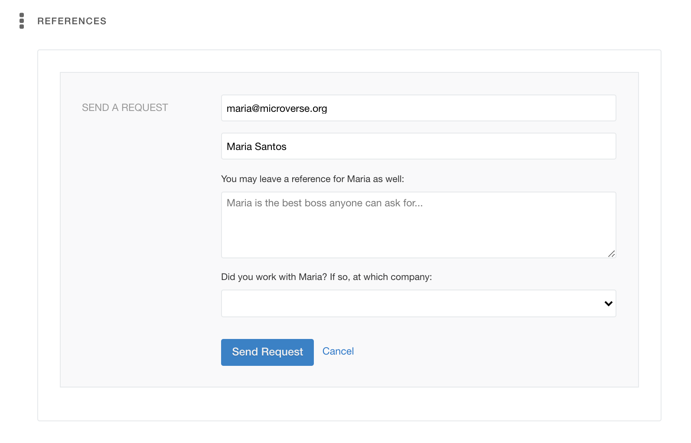

# A short guide to asking for references

To ask a connection for a reference, simply add your contact's e-mail and name to the Reference field, and then click Send Request.

Wellfound will automatically email them with a reference request. If you click the Advanced Details checkbox, you can also optionally **leave them a reference simultaneously**, and select your work relationship.

Again, this is optional, but a positive reference is a great way to strengthen your profile, and we do recommend it.

---

_If you spot any bugs or issues in this activity, you can [open an issue with your proposed change](https://github.com/microverseinc/curriculum-transversal-skills/blob/main/git-github/articles/open_issue.md)._
