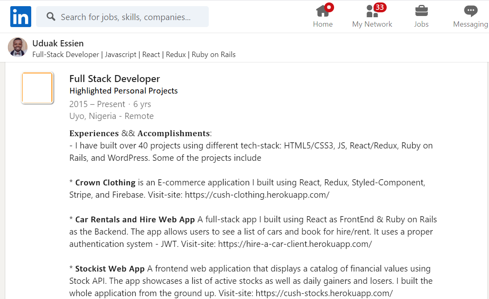

# Create an achievements-focused Experience section

To complete your Experience section, open up your resume and start copy-pasting each work experience into LinkedIn. List first your software development (or development-adjacent experience. If you have no work experience in this area, include your Microverse volunteer/mentorship experience, and also list your previous experience from other fields or industries (in **reverse-chronological order**). 

Then, when you're done, **review these four things** to make sure that your Experience section is good to go.

1. **Make sure that each bullet point is on a separate line**, and that all descriptions are formatted correctly. LinkedIn occasionally messes up formatting when copy/pasting. 
2. **Copy/pasting errors are common**; read your project descriptions out loud to make sure that you didn't accidentally omit a word or punctuation mark.
3. **Don't add Microverse to the Experience section unless you were a code reviewer, project reviewer, or otherwise were a contractor for Microverse**! The LinkedIn Experience section is for work experiences. You can add internships or part-time jobs here, but listing Microverse here (unless you actually did work for Microverse) can lead a hiring manager to think that you're trying to purposefully mislead them. 
4. **If you want your Microverse projects to be featured in the Experience section of your LinkedIn**, you can add a new experience called "Full Stack Software Developer" or similar, and in the "company name" field, enter the text "Highlighted Personal Projects". You can then proceed to describe the awesome projects you created at Microverse in this section. See the image below for an example.

 

### **If I have other experiences I didn't list on my resume, can I add them to LinkedIn?**

Sure! As we've mentioned, your resume is a **curated, 1-page document**, and that means you sometimes have to leave out less-important information. If you'd like to include them in your LinkedIn profile, **feel free to do so**. **However**, if you plan to add other experiences to your LinkedIn, [please return to the resume curriculum](create-the-first-draft-of-your-resume.md) and review the lesson on how to write accomplishment-focused bullet points** so that project reviewers/career coaches are able to approve your LinkedIn quickly.

------

_If you spot any bugs or issues in this activity, you can [open an issue with your proposed change](https://github.com/microverseinc/curriculum-transversal-skills/blob/main/git-github/articles/open_issue.md)._
