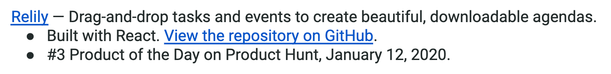

# Determining what to include in the optional Projects section

### **When should you include projects in your resume?**

Before you add a Projects section, it's important to determine whether a Projects section would help you or not. Let's take a look at a few common student scenarios:

If you've had no formal software development jobs: **yes**, you should include projects, but **don't list them in their own section**. Instead, add them under your "Full Stack Software Developer Experience" entry (see [this template](https://docs.google.com/document/d/1isShs6xwmLqRoBjsmDgMq1SBXkvd0GcKSOwpI4rAboE/edit) for an example). **Add 3-4 projects**, depending on how much space you have.

If you've had 1-2 software development jobs in the past: **yes**, you should include projects **in their own Projects section (**see [this template](https://docs.google.com/document/d/1jMxmTpC1kZT2F6wcyXeM_0NEdhuWbRhYeYUSaP0qNAk/edit) for an example). **Add 2-3 projects**, depending on how much space you have.

If you've had 3+ software development jobs in the past: **no,** don't include projects **unless** the project is either **open-source** (which many hiring managers find extremely valuable) or **significant** (large, complex, or well-known). Add **1-2 projects** in their own Projects section, depending on how much space you have.

Find the scenario that best fits your situation as you decide whether or not to include projects in your resume.

### **What should you include in the Projects section?**

Each project **must** include **at least** these **three elements**:

1. A link to the live project **and/or** a link to the GitHub repo. Use hyperlinks, not the full URL.
2. A brief 1-line summary of the project (you may use the GitHub project description). If the project is open-source, **also** include a brief 1-line summary of your contribution(s).
3. A list of the stack you used to build it.

Additionally, **if you are including a project because it is significant** (large, complex, or well-known), you should also include a 1-line summary of major accomplishments related to the project (for example, if it was the top app on ProductHunt for a day, or if it's been downloaded X number of times).

The templates above have built-in examples of how to format your project. Here's an example below:

------

_If you spot any bugs or issues in this activity, you can [open an issue with your proposed change](https://github.com/microverseinc/curriculum-transversal-skills/blob/main/git-github/articles/open_issue.md)._
