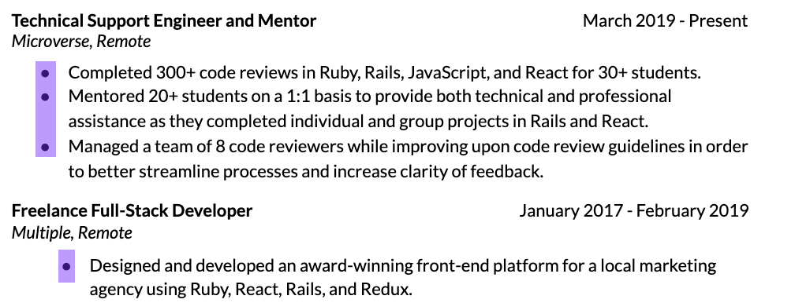
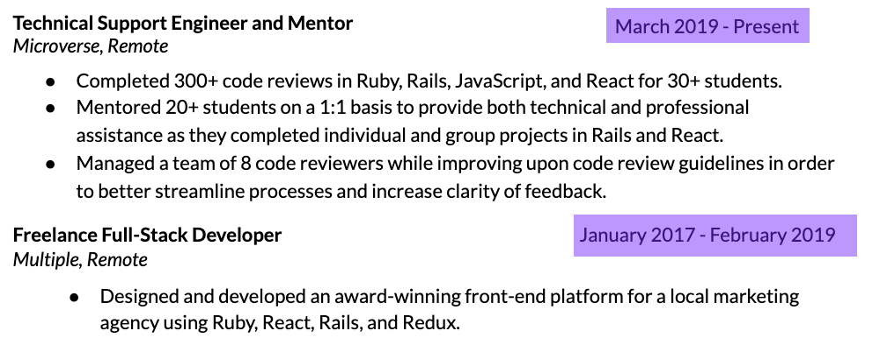
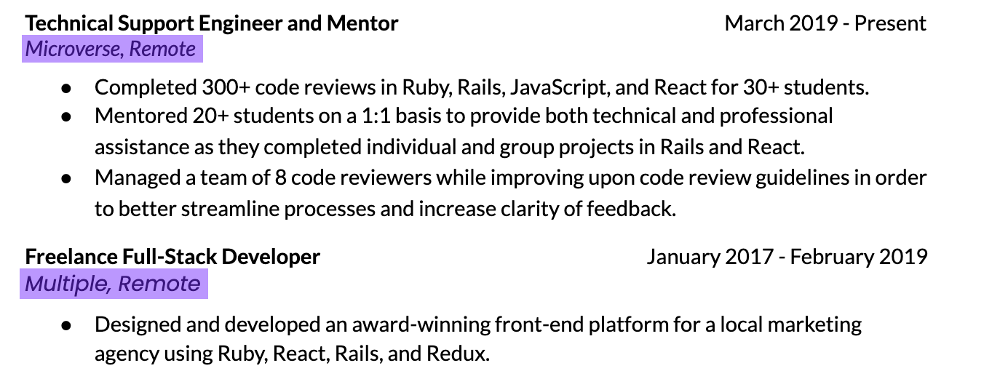
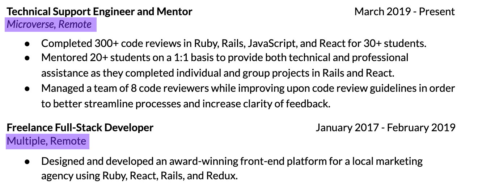
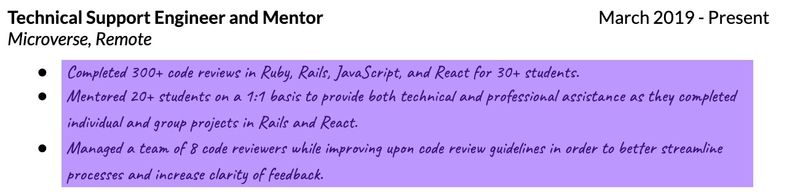

# Displaying your attention to detail with design consistency

In this lesson, we'll discuss all the ways in which your resume should be consistent.

### **Indentation Consistency**

Each similar segment should be indented identically. Take a look at the resume below:

This example resume uses two different indentation widths, resulting in a disorganized, off-balance appearance. The applicant should instead adjust the second indentation style to make them both equal.

Here's another example of an indentation error:

This resume indents the dates in two different ways; the second date entry appears to be aligned all the way to the right, but the first date entry is not. Again, this might seem like a small error, but as developers, you know that small errors (like missing parentheses) can cause big problems.   Hiring managers are very good at catching these sorts of errors, and will start to doubt your attention to detail if they see it.

### **Font and font style consistency**

Another required form of consistency is font and font style consistency. This means that fonts and font styles should be used uniformly: for example, if job titles are bolded in one entry, they should be bolded in the others. Below, you'll find an example of a resume that does not use fonts consistently.

The two entries above use different fonts for the company name and location; the first entry uses Lato, while the second entry uses Poppins (a slightly larger font). This type of error can be difficult to catch if the fonts are similar, but it's important to double check that fonts are used consistently across the entire resume.

Font style (such as deciding whether to italicize, bold, or underline text) is another important aspect. Examine the photo below:

In this example, the first entry italicizes the company name and location. The second entry does not. Again, it may seem like a small error, but if a hiring manager notices, it could hurt your chances of receiving an interview.

### **Note: be careful with font choice (and size)**

Your choice of font can be the difference between a rejection and an interview. Fonts that are difficult to read or "unprofessional" (like Papyrus and Comic Sans) can result in immediate rejections. The example below would be entirely incorrect for a resume.

Don't choose a quirky or "fun" font because you think it will get a hiring manager's attention. It won't be effective--at least, not in a positive way. Instead, choose a professional font, like Lato, Open Sans, or Georgia. Remember that hiring managers spend hours in front of a computer each day, and if your fonts are difficult to read, you’ll probably get immediately rejected.

For reference, [here’s a list of 10 readable fonts that work well on resumes](https://www.freecodecamp.org/news/these-are-the-most-effective-resume-fonts-in-2019/).

------

_If you spot any bugs or issues in this activity, you can [open an issue with your proposed change](https://github.com/microverseinc/curriculum-transversal-skills/blob/main/git-github/articles/open_issue.md)._
