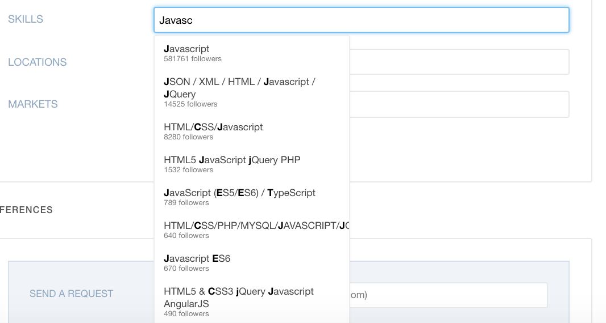

# How to correctly fill in the Skills section of your Wellfound profile

Open up LinkedIn and start adding all of the skills you've included there to your Wellfound profile. Keep the following things in mind:

- You must add each skill **one at a time**; if you try to copy/paste multiple skills at once, you'll break your keywords.
- Feel free to add additional skills/tools as well. LinkedIn limits you to 50, but Wellfound allows you to add more.
- Wellfound sometimes contains multiple versions of a keyword (for example, Javascript and Javascript ES6). Wellfound also allows you to see **how many people/groups use a specific keyword.** In the example below, you can see that Javascript has nearly 600,000 followers. However, Javascript ES6 has fewer than 1,000 followers. In other words, it's more likely that recruiters are using "Javascript" as a keyword, rather than "Javascript ES6." **Choose the keyword that has the most followers**. If the numbers are close, you can add both keywords.

---

_If you spot any bugs or issues in this activity, you can [open an issue with your proposed change](https://github.com/microverseinc/curriculum-transversal-skills/blob/main/git-github/articles/open_issue.md)._
