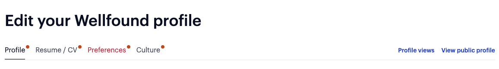

# What should you include in the Wellfound header?

### **Before You Begin**

Before you get started working on your profile, you should know that Wellfound actually has **two** places where you can edit your profile: on the **[Talent Profile](https://wellfound.com/profile/edit)** page, and on your **Public Wellfound Profile itself**. The Public Wellfound Profile is **the more complete version**, so we'll be primarily focusing on that. However, there are a few fields that are unfortunately only available on the Talent Profile, so we will later switch over.

To access the Public Wellfound profile, visit the [Talent Profile](https://wellfound.com/profile/edit) and then click **View Public Profile.**

There, you will see your incomplete public profile; this is what everyone else sees when they visit your Wellfound, and this is what we'll be editing today.

# **Add Cover Photo**

A cover photo is a quick, easy way to bring personality to your Wellfound profile. Feel free to re-use the version you used for LinkedIn, or choose another high-quality image instead.

**An important note:** the Wellfound cover photo is intended to take up more space than a LinkedIn cover photo, so a medium-sized image that worked for LinkedIn may appear stretched out or pixelated on Wellfound. **Be sure to use a high-quality image, even if it means having to choose another cover photo.**

# **Edit the Header Basics**

Clicking on the "Edit" icon on the upper right corner of the header will allow you to edit every section of your header, from your username to your photo. We'll go through each one.

**Name:** Input your full name (first and last). If you go by a nickname or middle name instead of your first name, feel free to use that instead.

**Username**: **Update your username**, preferably to the same one you used for LinkedIn.

**Photo**: Upload the **professional photo** you used for LinkedIn and GitHub.

**Mini-Resume**: Copy/paste your **LinkedIn headline.** Make sure to **also include your tech stack**.

**Role:** Add "Software Engineer"

**Location:** Add your city, state, and/or country.

# **Add Relevant Links**

At a **minimum**, you **must include these 3 links**:

- Your LinkedIn profile
- Your GitHub profile
- Your portfolio

If you have a professional Twitter account, or an active blog or Stack Overflow account, you may also link those. However, don't link to miscellaneous empty accounts; only link to accounts that are professional, valuable, and in-use.

When you're done, click the blue "Save" button to save changes. Then click "Next" to continue.

---

_If you spot any bugs or issues in this activity, you can [open an issue with your proposed change](https://github.com/microverseinc/curriculum-transversal-skills/blob/main/git-github/articles/open_issue.md)._
