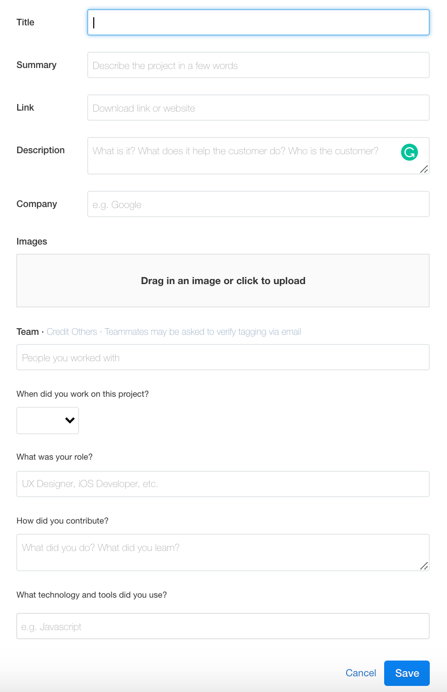

# What should you include in the Projects section?

Choose **3-5 of your strongest projects** and copy/paste them over from LinkedIn. **Fill out every field**. Here are a few notes to make the process easier:

- **Do not add HTML clones.**
- The **Summary** **field** is the first sentence of the LinkedIn description (for example, "_A weather app that pulls from the OpenWeatherMap API_"). The rest of the LinkedIn description goes in the Wellfound **Description field** (for example, "_Users are able to select a location, choose between Fahrenheit and Celsius, and view allergen information_").
- If you created the app while a student at Microverse, type "Self-Employed" for the Company field, not "Microverse."
- Use screenshots that show the project **in-use**. For example, don't use a screenshot of a login page—instead, use screenshots that show what a project looks like once different types of posts have been added.
- Use the **How did you contribute?** field to explain whether you worked on the project solo or if you did it as part of a team. For example, "I was the sole developer on this project," "I worked alongside a team of 3 other developers," or "I built this project while pair-programming with [student_name]."

Again, make sure to add no less than 3 and no more than 5 of your best, most complex projects.

---

_If you spot any bugs or issues in this activity, you can [open an issue with your proposed change](https://github.com/microverseinc/curriculum-transversal-skills/blob/main/git-github/articles/open_issue.md)._
